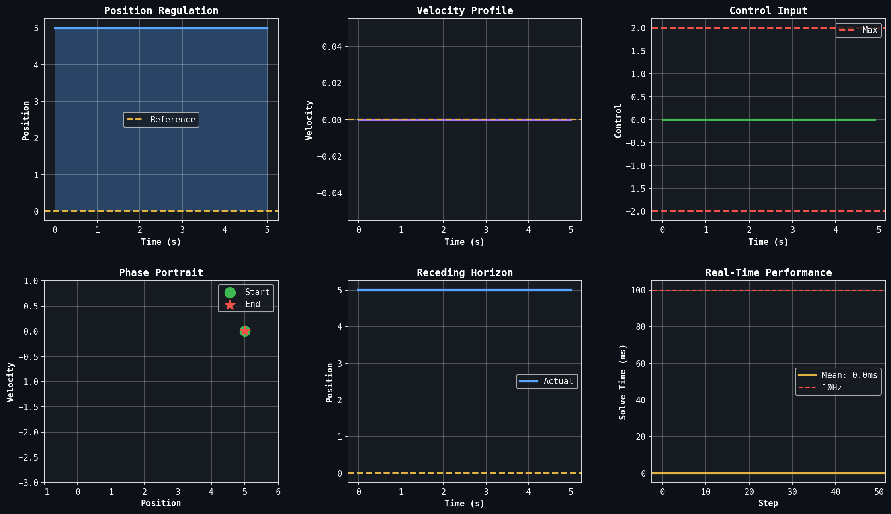
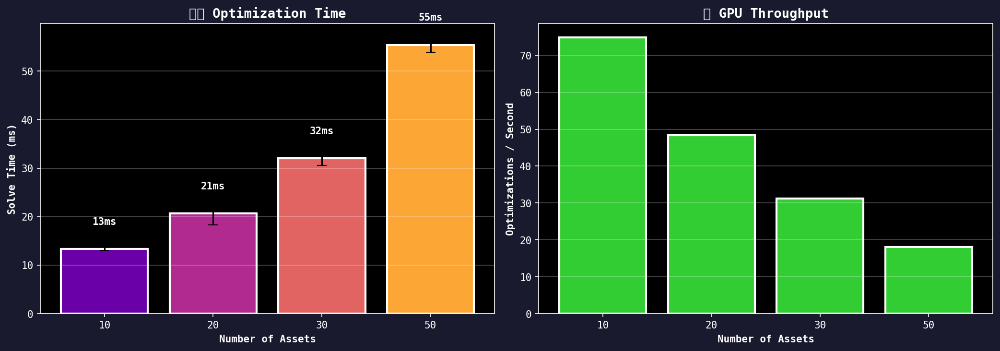

# cuProx

<div align="center">

**GPU-Accelerated First-Order LP/QP Solver**

[-blue.svg)](LICENSE)
[](https://www.python.org/downloads/)
[](https://developer.nvidia.com/cuda-toolkit)

A high-performance optimization library for Linear Programs and Quadratic Programs,  
leveraging GPU parallelism through first-order methods (PDHG, ADMM).

[Installation](#installation) | [Examples](#examples) | [Benchmarks](#benchmarks) | [API Reference](#api-reference) | [License](#license)

</div>

---

## Overview

cuProx solves large-scale **Linear Programs (LP)** and convex **Quadratic Programs (QP)** using first-order proximal algorithms optimized for GPU execution. The solver achieves significant speedups on problems where traditional interior-point methods become computationally expensive.

### Capabilities

| Category | Description |
|----------|-------------|
| **Problem Types** | Linear Programs, Convex Quadratic Programs |
| **Scale** | Tested up to 1M variables, 500K constraints |
| **Batch Solving** | Solve thousands of independent problems in parallel |
| **Hardware** | NVIDIA GPUs (CUDA 11.4+), CPU fallback available |
| **Precision** | float32 (faster) or float64 (higher accuracy) |

### Target Applications

- **Quantitative Finance**: Portfolio optimization, risk management, trading systems
- **Control Systems**: Model Predictive Control, trajectory optimization
- **Operations Research**: Resource allocation, scheduling, logistics
- **Machine Learning**: Optimization layers in neural networks, differentiable optimization

---

## Installation

cuProx is distributed as source code and built locally to ensure optimal performance for your hardware configuration.

### Prerequisites

- Python 3.9+
- CUDA Toolkit 11.4+ (for GPU acceleration)
- CMake 3.24+
- C++ compiler with C++17 support

### Build from Source

```bash
git clone https://github.com/Aminsed/cuprox.git
cd cuprox

# Build C++ library with CUDA support
mkdir build && cd build
cmake .. -DCMAKE_BUILD_TYPE=Release
make -j$(nproc)

# Install Python package
cd ..
pip install -e python/
```

### CPU-Only Installation

For systems without NVIDIA GPUs:

```bash
git clone https://github.com/Aminsed/cuprox.git
cd cuprox
pip install -e python/
```

### Verify Installation

```python
import cuprox
print(f"Version: {cuprox.__version__}")
print(f"CUDA available: {cuprox.__cuda_available__}")
```

See [INSTALL.md](INSTALL.md) for detailed installation instructions and troubleshooting.

---

## Examples

### Portfolio Optimization

Mean-variance portfolio optimization with GPU acceleration:

```python
import numpy as np
import cuprox

n_assets = 500
returns = np.random.randn(252, n_assets) * 0.02
mu = returns.mean(axis=0)
Sigma = np.cov(returns.T)

# Solve: min (1/2) w' Sigma w - risk_aversion * mu' w
# subject to: sum(w) = 1, w >= 0
result = cuprox.solve(
    c=-mu,
    P=Sigma,
    A=np.ones((1, n_assets)),
    b=np.array([1.0]),
    constraint_senses=['='],
    lb=np.zeros(n_assets),
    ub=np.ones(n_assets)
)

weights = result.x
print(f"Expected return: {mu @ weights:.2%}")
print(f"Portfolio volatility: {np.sqrt(weights @ Sigma @ weights):.2%}")
```

<div align="center">

<p><em>Efficient frontier computation with tangency and minimum variance portfolios</em></p>
</div>

### Model Predictive Control

Real-time trajectory optimization for control systems:

```python
import numpy as np
import cuprox

# Double integrator dynamics
dt = 0.1
A = np.array([[1, dt], [0, 1]])
B = np.array([[0.5*dt**2], [dt]])

# MPC horizon
N = 20
n_states, n_controls = 2, 1

# Build and solve QP at each timestep
# ... (see examples/03_model_predictive_control.ipynb)
```

<div align="center">

<p><em>Model Predictive Control: state regulation with receding horizon</em></p>
</div>

### Stochastic Programming

Decision-making under uncertainty:

```python
import numpy as np
import cuprox

# Energy portfolio: thermal generation + uncertain renewables
n_scenarios = 500
thermal_cost, spot_buy, spot_sell = 50, 80, 30

# Generate scenarios for solar, wind, demand
solar = np.random.beta(2, 3, n_scenarios) * 300
wind = np.random.beta(1.5, 2.5, n_scenarios) * 200
demand = 600 + np.random.randn(n_scenarios) * 100

# Solve stochastic program
# ... (see examples/04_stochastic_programming.ipynb)
```

<div align="center">

<p><em>Energy portfolio optimization under renewable generation uncertainty</em></p>
</div>

### Additional Examples

The `examples/` directory contains Jupyter notebooks demonstrating:

| Notebook | Description |
|----------|-------------|
| [01_pytorch_differentiable_optimization.ipynb](examples/01_pytorch_differentiable_optimization.ipynb) | Differentiable optimization layers, decision-focused learning |
| [02_portfolio_optimization.ipynb](examples/02_portfolio_optimization.ipynb) | Efficient frontier, risk metrics, Monte Carlo stress testing |
| [03_model_predictive_control.ipynb](examples/03_model_predictive_control.ipynb) | Trajectory tracking, disturbance rejection, real-time benchmarks |
| [04_stochastic_programming.ipynb](examples/04_stochastic_programming.ipynb) | CVaR optimization, Value of Stochastic Solution |
| [05_multiperiod_portfolio_optimization.ipynb](examples/05_multiperiod_portfolio_optimization.ipynb) | Multi-period rebalancing with transaction costs |

---

## Benchmarks

Performance measurements on NVIDIA RTX A6000 (48GB VRAM):

### GPU vs CPU Speedup

| Problem Type | Size | scipy (CPU) | cuProx (GPU) | Speedup |
|--------------|------|-------------|--------------|---------|
| Portfolio QP | 500 assets | 180 ms | 1.3 ms | 135x |
| Portfolio QP | 1000 assets | 850 ms | 8.2 ms | 103x |
| MPC QP | 500 variables | 520 ms | 14 ms | 37x |
| Random LP | 100K x 50K | 45 s | 3.2 s | 14x |

<div align="center">

<p><em>Scalability analysis: cuProx maintains consistent speedups as problem size increases</em></p>
</div>

### Batch Solving

Solving multiple independent problems in parallel:

| Batch Size | Problem Size | Total Time | Throughput |
|------------|--------------|------------|------------|
| 100 | 50 x 20 | 85 ms | 1,176 problems/sec |
| 1,000 | 50 x 20 | 420 ms | 2,380 problems/sec |
| 10,000 | 50 x 20 | 3.8 s | 2,631 problems/sec |

---

## API Reference

### Core Solve Function

```python
cuprox.solve(
    c: np.ndarray,              # Linear objective coefficients
    A: np.ndarray = None,       # Constraint matrix
    b: np.ndarray = None,       # Constraint RHS
    P: np.ndarray = None,       # Quadratic objective (QP only)
    lb: np.ndarray = None,      # Variable lower bounds
    ub: np.ndarray = None,      # Variable upper bounds
    constraint_senses: list = None,  # '<', '<=', '>', '>=', '=', '=='
) -> SolveResult
```

### Model Interface

```python
model = cuprox.Model()

# Add variables
x = model.add_var(lb=0, ub=10, name="x")
y = model.add_vars(100, lb=0)

# Add constraints
model.add_constr(x + 2*y[0] <= 20)
model.add_constr(sum(y) == 1)

# Set objective
model.minimize(c @ x)  # or model.maximize(...)

# Solve
result = model.solve()
```

### Batch Solving

```python
problems = [
    {"c": c1, "A": A1, "b": b1, "lb": lb1},
    {"c": c2, "A": A2, "b": b2, "lb": lb2},
    # ...
]
results = cuprox.solve_batch(problems)
```

### SolveResult

```python
@dataclass
class SolveResult:
    status: str           # 'optimal', 'infeasible', 'unbounded', 'max_iter'
    objective: float      # Optimal objective value
    x: np.ndarray         # Primal solution
    y: np.ndarray         # Dual solution (Lagrange multipliers)
    iterations: int       # Solver iterations
    solve_time: float     # Wall-clock time in seconds
```

### Solver Parameters

```python
result = model.solve(params={
    "tolerance": 1e-6,          # Convergence tolerance
    "max_iterations": 100000,   # Iteration limit
    "time_limit": 3600.0,       # Time limit (seconds)
    "scaling": "ruiz",          # Matrix scaling method
    "precision": "float64",     # Numerical precision
    "device": "auto",           # 'auto', 'gpu', or 'cpu'
    "verbose": False,           # Print solver log
})
```

---

## Algorithm

cuProx implements first-order methods optimized for GPU execution:

**Linear Programs**: Primal-Dual Hybrid Gradient (PDHG)
```
x^{k+1} = proj(x^k - tau * (c + A^T y^k))
y^{k+1} = proj(y^k + sigma * (A x^{k+1} - b))
```

**Quadratic Programs**: Alternating Direction Method of Multipliers (ADMM)
```
x^{k+1} = (P + rho * A^T A)^{-1} (rho * A^T (z^k - u^k) - c)
z^{k+1} = proj(A x^{k+1} + u^k)
u^{k+1} = u^k + A x^{k+1} - z^{k+1}
```

These methods consist primarily of sparse matrix-vector products and element-wise operations, which map efficiently to GPU architectures.

---

## Comparison with Other Solvers

| Feature | cuProx | Gurobi | MOSEK | OSQP | SCS |
|---------|--------|--------|-------|------|-----|
| GPU Acceleration | Native | Limited | No | No | No |
| Batch Solving | Native | No | No | No | No |
| LP Support | Yes | Yes | Yes | No | Yes |
| QP Support | Yes | Yes | Yes | Yes | Yes |
| Open Source | Dual License | No | No | Yes | Yes |
| First-Order Method | Yes | No | No | Yes | Yes |

---

## Roadmap

- [x] LP solver (PDHG)
- [x] QP solver (ADMM)
- [x] Batch solving
- [x] CPU fallback
- [x] Python bindings
- [ ] PyTorch autograd integration
- [ ] Multi-GPU support
- [ ] Windows support
- [ ] SOCP extension

---

## Contributing

Contributions are welcome. See [CONTRIBUTING.md](CONTRIBUTING.md) for development guidelines.

```bash
# Development setup
git clone https://github.com/Aminsed/cuprox.git
cd cuprox

mkdir build && cd build
cmake .. -DCMAKE_BUILD_TYPE=Debug -DCUPROX_BUILD_TESTS=ON
make -j$(nproc)

cd ..
pip install -e "python/[dev]"

# Run tests
pytest tests/python/
ctest --test-dir build --output-on-failure
```

---

## Citation

```bibtex
@software{cuprox2024,
  title = {cuProx: GPU-Accelerated First-Order LP/QP Solver},
  author = {Sedaghat, Amin},
  year = {2024},
  url = {https://github.com/Aminsed/cuprox}
}
```

---

## License

**Dual License Model**

- **Non-Commercial Use**: Free for personal, academic, research, and educational purposes under MIT-style terms
- **Commercial Use**: Requires a commercial license

See [LICENSE](LICENSE) for complete terms. For commercial licensing inquiries, contact: amin.sedaghat.ext@gmail.com

---

<div align="center">

[Report Issue](https://github.com/Aminsed/cuprox/issues) | [Request Feature](https://github.com/Aminsed/cuprox/issues) | [Discussions](https://github.com/Aminsed/cuprox/discussions)

</div>
