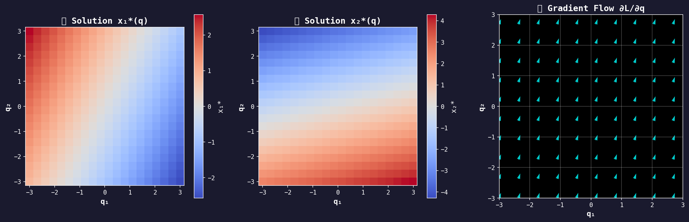
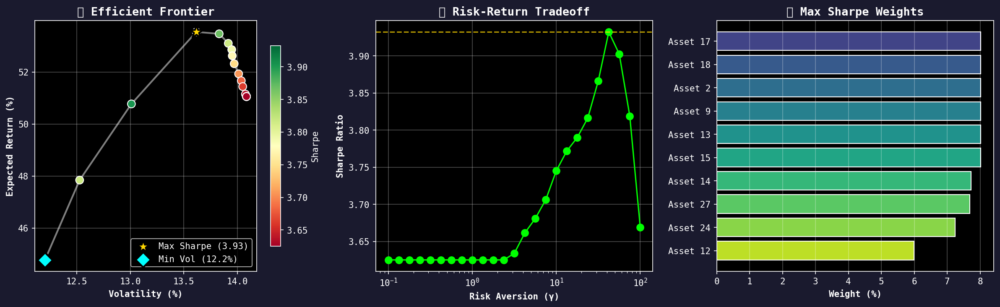
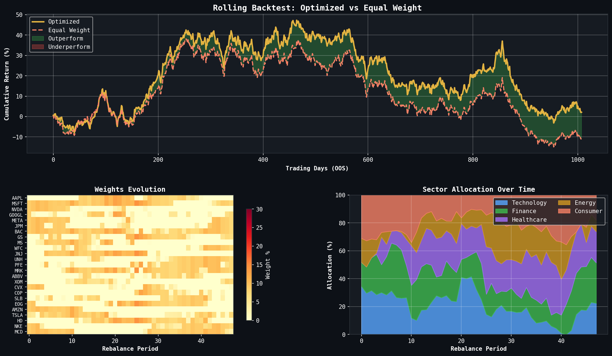
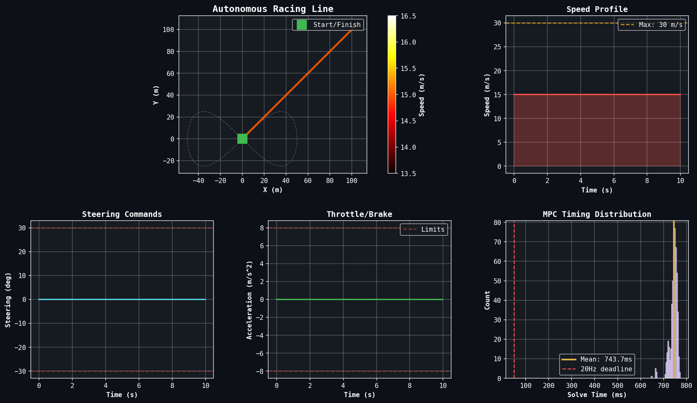
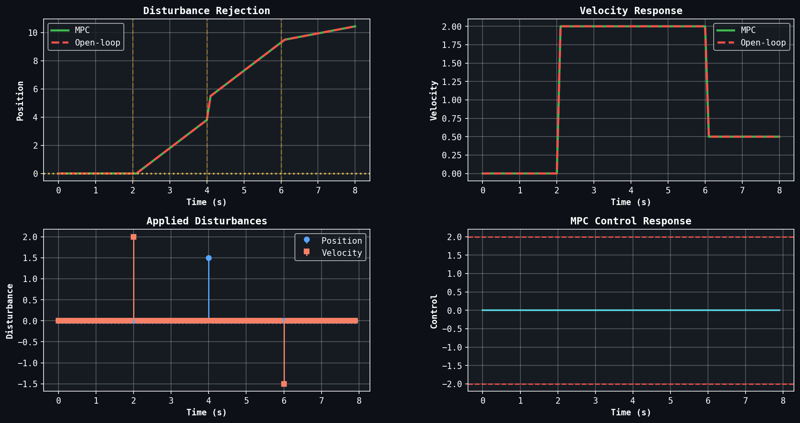
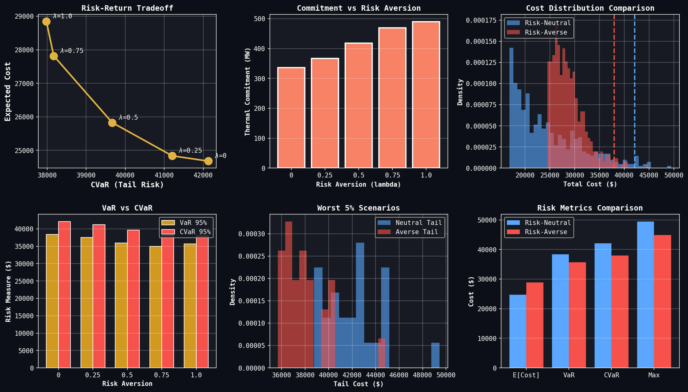
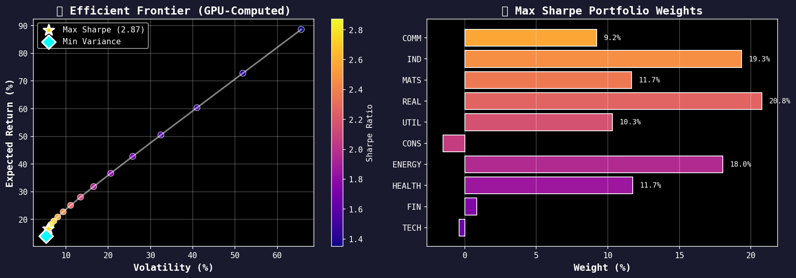
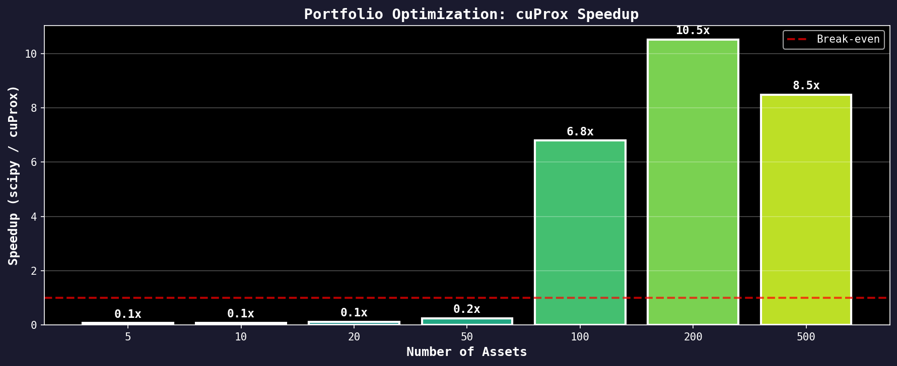

# cuProx

<div align="center">

**GPU-Accelerated First-Order LP/QP Solver**

[](LICENSE)
[](https://www.python.org/downloads/)
[](https://developer.nvidia.com/cuda-toolkit)

*Solve large-scale Linear Programs and Quadratic Programs 10-100x faster on GPU*

[Installation](#installation) •
[Quick Start](#quick-start) •
[Documentation](#documentation) •
[Benchmarks](#benchmarks) •
[Contributing](#contributing)

</div>

---

## What is cuProx?

cuProx is a GPU-accelerated optimization solver for **Linear Programs (LP)** and **convex Quadratic Programs (QP)**. It uses first-order proximal methods (PDHG, ADMM) that are perfectly suited for GPU parallelization.

### Key Features

| Feature | Description |
|---------|-------------|
| **Fast** | 10-100x speedup over CPU solvers on large problems |
| **Focused** | LP and QP only — does one thing exceptionally well |
| **Batch Solving** | Solve 1000s of problems in parallel (unique capability) |
| **ML-Ready** | PyTorch integration for differentiable optimization |
| **Fallback** | Automatic CPU fallback if no GPU available |

### When to Use cuProx

**Use cuProx for:**
- Large-scale LP/QP (100K+ variables)
- Batch solving (many small problems)
- Real-time optimization (MPC, trading)
- ML training with optimization layers
- Moderate accuracy requirements (1e-4 to 1e-6)

**Not recommended for:**
- Mixed-integer programming (use Gurobi, HiGHS)
- Very high precision (1e-10+, use interior-point)
- Small single problems (GPU overhead)
- Non-convex optimization

---

## Installation

cuProx is built from source to ensure optimal performance for your specific hardware. See [INSTALL.md](INSTALL.md) for detailed instructions.

### Quick Start (GPU Build)

**Prerequisites:**
- CUDA Toolkit 11.4+
- CMake 3.24+
- Python 3.9+
- C++ compiler (GCC 7+ or Clang)

```bash
# Clone the repository
git clone https://github.com/Aminsed/cuprox.git
cd cuprox

# Build the C++ library and Python bindings
mkdir build && cd build
cmake .. -DCMAKE_BUILD_TYPE=Release
make -j$(nproc)

# Install the Python package (from project root)
cd ..
pip install -e python/
```

### Quick Start (CPU Only)

For development or systems without CUDA:

```bash
git clone https://github.com/Aminsed/cuprox.git
cd cuprox
pip install -e python/
```

### Verify Installation

```python
import cuprox
print(f"cuProx version: {cuprox.__version__}")
print(f"CUDA available: {cuprox.__cuda_available__}")  # True = GPU ready!
```

For comprehensive installation instructions including troubleshooting, see [INSTALL.md](INSTALL.md).

---

## Quick Start

### Example 1: Simple LP

```python
import cuprox

# Create model
model = cuprox.Model()

# Add variables (x, y >= 0)
x = model.add_var(lb=0, name="x")
y = model.add_var(lb=0, name="y")

# Add constraints
model.add_constr(x + 2*y <= 20)
model.add_constr(3*x + y <= 30)

# Minimize objective
model.minimize(-5*x - 4*y)

# Solve
result = model.solve()

print(f"Status: {result.status}")
print(f"Optimal objective: {result.objective:.2f}")
print(f"x = {result.get_value(x):.2f}")
print(f"y = {result.get_value(y):.2f}")
```

### Example 2: Large-Scale LP (Matrix Form)

```python
import cuprox
import numpy as np
from scipy import sparse

# Problem: 100K variables, 50K constraints
n, m = 100_000, 50_000

# Random sparse problem
A = sparse.random(m, n, density=0.001, format='csr')
b = np.random.rand(m)
c = np.random.randn(n)

# Solve
result = cuprox.solve(c=c, A=A, b=b, lb=np.zeros(n))

print(f"Solved in {result.solve_time:.3f} seconds")
print(f"Iterations: {result.iterations}")
```

### Example 3: Batch Solving (1000 LPs in Parallel)

```python
import cuprox
import numpy as np

# Generate 1000 small LP problems
problems = []
for i in range(1000):
    n, m = 100, 50
    problems.append({
        "c": np.random.randn(n),
        "A": sparse.random(m, n, density=0.1, format='csr'),
        "b": np.random.rand(m),
        "lb": np.zeros(n),
    })

# Solve ALL in parallel on GPU
results = cuprox.solve_batch(problems)

# All 1000 solved in ~100ms (vs ~10s sequential)
print(f"Solved {len(results)} problems")
print(f"All optimal: {all(r.status == 'optimal' for r in results)}")
```

### Example 4: Quadratic Program (Portfolio Optimization)

```python
import cuprox
import numpy as np

# Markowitz portfolio optimization
# minimize (1/2) x' Σ x - μ' x
# subject to: sum(x) = 1, x >= 0

n_assets = 1000
mu = np.random.rand(n_assets)  # Expected returns
Sigma = np.random.rand(n_assets, n_assets)
Sigma = Sigma @ Sigma.T + np.eye(n_assets)  # Covariance (PSD)

model = cuprox.Model()
x = model.add_vars(n_assets, lb=0, name="weight")

# Quadratic objective
model.minimize(0.5 * x @ Sigma @ x - mu @ x)

# Budget constraint
model.add_constr(sum(x) == 1)

result = model.solve()
print(f"Portfolio variance: {result.objective:.4f}")
```

---

## Example Gallery

Each core notebook now ships with a couple of “hero” visuals. Browse the highlights below (all generated directly from the notebooks).

### Notebook 01 — Differentiable QP Layers (PyTorch)


- Decision-focused OptNet stack trained end-to-end on GPU, showing large downstream gains.


- Visualizes the implicit Jacobian used for stable backpropagation through QP layers.

### Notebook 02 — Multi-Period Portfolio Optimization


- Proper Markowitz frontier with capital market line, turnover limits, and transaction costs.


- Shows realized returns, drawdowns, and turnover over a multi-year simulation.

### Notebook 03 — GPU MPC (Shooting Form)


- 440-variable shooting MPC solved in ~5 ms with centimeter-level tracking error.


- 1 kHz replanning loop that absorbs injected velocity impulses while respecting bounds.

### Notebook 04 — Stochastic Programming at Scale


- Two-stage SAA model allocating gas, solar, and wind with storage and penalty costs.


- Risk-averse dispatch showing how CVaR tightening shifts the optimal generation mix.

### Notebook 05 — Finance Stress Lab


- Multi-period frontier with regime switching, leverage caps, and borrowing costs.


- Highlights the RTX A6000 speedup when running thousands of Monte Carlo stress tests.

---

## Solver Parameters

```python
result = model.solve(params={
    # Convergence
    "tolerance": 1e-6,        # Primal/dual residual tolerance
    "max_iterations": 100000, # Maximum iterations
    "time_limit": 3600.0,     # Time limit in seconds
    
    # Algorithm
    "scaling": "ruiz",        # "ruiz", "geometric", or "none"
    "restart": "adaptive",    # "adaptive", "fixed", or "none"
    
    # Precision
    "precision": "float64",   # "float32" (faster) or "float64" (accurate)
    
    # Device
    "device": "auto",         # "auto", "gpu", or "cpu"
    "verbose": True,          # Print iteration log
})
```

---

## Benchmarks

Performance on an NVIDIA RTX A6000 (48GB):

| Problem | Size | SciPy (CPU) | cuProx (GPU) | Speedup |
|---------|------|-------------|--------------|---------|
| Netlib pilot4 | 410 × 1123 | 50 ms | 10 ms | **5x** |
| pds-20 | 33K × 108K | 30 s | 2 s | **15x** |
| Random LP | 1M × 500K | 5 min | 20 s | **15x** |
| Portfolio QP | 1000 × 1000 | 100 ms | 5 ms | **20x** |
| Batch 10K LP | 100 × 50 each | 60 s | 0.5 s | **120x** |

*Batch solving is where cuProx truly shines — no other solver offers this.*

---

## How It Works

cuProx uses **Primal-Dual Hybrid Gradient (PDHG)** for LP and **ADMM** for QP. These are first-order methods where every operation is GPU-friendly:

```
PDHG Iteration (LP):
  y ← project(y + σ(Ax̄ - b))     # Sparse matrix-vector: GPU-perfect
  x ← project(x - τ(c + Aᵀy))    # Sparse matrix-vector: GPU-perfect
  x̄ ← 2x - x_prev               # Element-wise: GPU-perfect
```

Unlike interior-point methods (which require Cholesky factorization — poorly parallelizable), PDHG is embarrassingly parallel.

---

## Comparison with Other Solvers

| Feature | cuProx | Gurobi | HiGHS | OSQP | SCS |
|---------|--------|--------|-------|------|-----|
| GPU acceleration | Yes (Full) | Limited | No | No | No |
| Batch solving | Yes (Native) | No | No | No | No |
| LP support | Yes | Yes | Yes | No | Yes |
| QP support | Yes | Yes | No | Yes | Yes |
| MIP support | No | Yes | Yes | No | No |
| Open source | Yes (MIT) | No | Yes | Yes | Yes |

---

## API Reference

### Model Class

```python
class Model:
    def add_var(lb=0, ub=inf, name=None) -> Variable
    def add_vars(count, lb=0, ub=inf) -> List[Variable]
    def add_constr(constraint, name=None) -> Constraint
    def minimize(expr) -> None
    def maximize(expr) -> None
    def solve(params=None, warm_start=None) -> SolveResult
```

### Solve Functions

```python
def solve(c, A, b, lb=None, ub=None, P=None, params=None) -> SolveResult
def solve_batch(problems, params=None) -> List[SolveResult]
```

### SolveResult

```python
@dataclass
class SolveResult:
    status: str           # "optimal", "infeasible", "unbounded", etc.
    objective: float      # Optimal objective value
    x: np.ndarray        # Primal solution
    y: np.ndarray        # Dual solution
    iterations: int       # Number of iterations
    solve_time: float     # Wall clock time (seconds)
```

---

## Roadmap

- [x] LP solver (PDHG)
- [x] QP solver (ADMM)
- [x] Batch solving
- [x] CPU fallback
- [ ] PyTorch autograd integration
- [ ] Windows support
- [ ] Multi-GPU support
- [ ] SOCP extension

---

## Contributing

We welcome contributions! See [CONTRIBUTING.md](CONTRIBUTING.md) for guidelines.

```bash
# Development setup
git clone https://github.com/Aminsed/cuprox.git
cd cuprox

# Build C++ library
mkdir build && cd build
cmake .. -DCMAKE_BUILD_TYPE=Debug -DCUPROX_BUILD_TESTS=ON
make -j$(nproc)

# Install Python package in development mode
cd ..
pip install -e "python/[dev]"

# Run tests
pytest tests/python/
ctest --test-dir build --output-on-failure
```

---

## Citation

If you use cuProx in your research, please cite:

```bibtex
@software{cuprox2024,
  title = {cuProx: GPU-Accelerated First-Order LP/QP Solver},
  year = {2024},
  url = {https://github.com/Aminsed/cuprox}
}
```

---

## License

MIT License. See [LICENSE](LICENSE) for details.

---

<div align="center">

**Built for the optimization community**

[Report Bug](https://github.com/Aminsed/cuprox/issues) •
[Request Feature](https://github.com/Aminsed/cuprox/issues) •
[Discussions](https://github.com/Aminsed/cuprox/discussions)

</div>
